<!-- HEADER -->

 

<!-- TYPING -->

  

<!-- BADGES -->

&nbsp;

&nbsp;

---

## ⚡ System Telemetry (`GET /api/v1/engineer`)

<table>
  <tr>
    <td width="50%" valign="top">
      <h4>👤 Identity & Background</h4>
      <ul>
        <li><b>Name:</b> Ravli Rapdani</li>
        <li><b>Role:</b> Backend Engineer & Mobile Developer</li>
        <li><b>Education:</b> Politeknik Negeri Indramayu</li>
        <li><b>Location:</b> Indramayu, Indonesia 🇮🇩</li>
      </ul>
    </td>
    <td width="50%" valign="top">
      <h4>🚀 Current Status & Focus</h4>
      <ul>
        <li><b>Active Core:</b> BKU Student Hub (11 User Roles)</li>
        <li><b>Stack:</b> Go (Fiber) • PostgreSQL • React • Flutter</li>
        <li><b>Status:</b> <code>200 OK — Operational</code></li>
        <li><b>Open To:</b> Internship • Full-Time • Open Source</li>
      </ul>
    </td>
  </tr>
</table>

---

## `$ cat stack.json`

**Languages**

**Backend & Database**

**Frontend & Mobile**

**Tools**

---

## `$ ls ./projects`

| Project | Description | Stack | Link |
|:---|:---|:---|:---:|
| **BKU Student Hub** | Enterprise campus system · 11 user roles · RBAC | Go · Fiber · PostgreSQL · React | 🔒 |
| **go-health Mobile** | Healthcare mobile application | Flutter · Dart | [↗](https://github.com/Ravlirap/proyek3-app) |
| **go-health Web** | Web platform for health services | PHP · Laravel Blade | [↗](https://github.com/Ravlirap/proyek3-web) |
| **Tripmate Mobile** | Smart travel companion app | Flutter · Dart | [↗](https://github.com/Ravlirap/tripmate-mobile) |
| **Dataset Al-Quran** | Quranic verse audio dataset for ML | Python | [↗](https://github.com/Ravlirap/dataset-quran) |
| **Porto Backend** | Portfolio REST API server | Node.js | [↗](https://github.com/Ravlirap/porto-be) |

---

## `$ gh stats --user ravlirap`

<table>
  <tr>
    <td align="center">
      
    </td>
    <td align="center">
      
    </td>
  </tr>
</table>

---

## `$ gh streak --user ravlirap`

---

## `$ gh activity --graph`

---

## `$ gh trophy --user ravlirap`

---

## `$ watch contribution-snake`

<picture>
  <source media="(prefers-color-scheme: dark)" srcset="https://raw.githubusercontent.com/Ravlirap/Ravlirap/output/github-contribution-grid-snake-dark.svg">
  
</picture>

---

## `$ ping ravlirap`

&nbsp;

&nbsp;

&nbsp;

  
⭐ Star a repo if something catches your eye!

